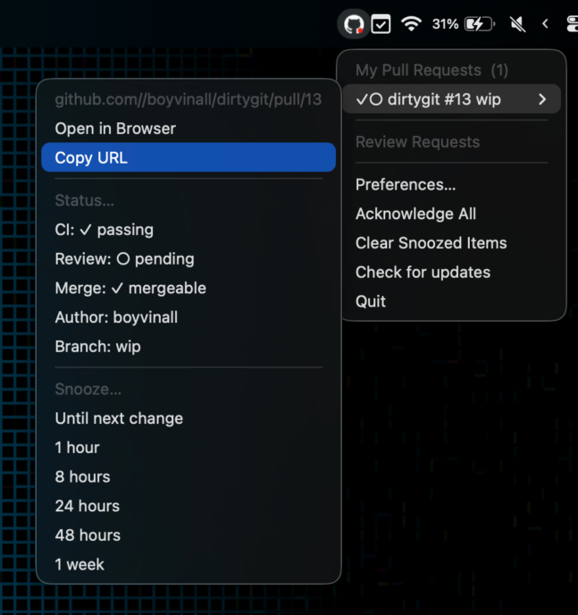

# ghnotify

A macOS menubar app that monitors GitHub pull requests — yours and review
requests from others — across github.com and GitHub Enterprise Server instances.



## Features

- **My Pull Requests** — draft, approved, changes-requested, CI status, merge readiness
- **Review Requests** — all open PRs where you're a requested reviewer
- **Activity Indicator** – red dot in the tray icon when there's new/unacknowledged activity.
  Use `Acknowledge All` to clear this whilst leaving the PRs in the list.
- **OS notifications** for review requests, approvals, CI changes (individually configurable)
- **Snooze** a PR until next change or for a fixed duration. Snoozed items will disappear from the list.
- **Multiple servers** — github.com + any number of GitHub Enterprise instances
- **gh CLI integration** — servers and auth tokens discovered automatically from the [gh](https://cli.github.com/) CLI

<!-- 
## Installation

### Download binary (recommended)

Download the latest `ghnotify_darwin_universal.zip` from the
[Releases page](https://github.com/boyvinall/ghnotify/releases), unzip, and
move the binary somewhere on your `$PATH`:

```sh
unzip ghnotify_darwin_universal.zip
sudo mv ghnotify /usr/local/bin/
```

On first launch macOS may quarantine the binary. Run once to clear it:

```sh
xattr -d com.apple.quarantine /usr/local/bin/ghnotify
```
-->

## Build/install from source

Requires Go 1.25+ and Xcode Command Line Tools (`xcode-select --install`).

```sh
git clone https://github.com/boyvinall/ghnotify
cd ghnotify
make install # builds and copies the app to /Applications/ghnotify.app
```

For other available `make` targets, you can run:

```sh
make help
```

## First-time setup

If you've not previously used the [gh](https://cli.github.com/) CLI, then follow instructions
there on how to install it. Then you need to authenticate against a server to add it to the list.  If you don't specify a hostname then this will login to github.com, otherwise you can
specify your github enterprise hostname there.

```plaintext
gh auth login [ --hostname <hostname> ]
```

## Configuration

Config file: `~/Library/Application Support/ghnotify/config.toml`
(created with defaults on first run; open via **Preferences…** in the menu)

```toml
# How often to poll each server for changes. Go duration string (e.g. "30s", "5m").
poll_interval = "120s"

# Filter out PRs older than this duration. Empty string disables the filter.
max_pr_age = "168h"

# Maximum PRs shown per section (My PRs / Review Requests).
# Additional PRs are noted as "… and N more".
max_prs_per_section = 20

# Authors to exclude from polling (useful for bot accounts).
exclude_authors = ["app/renovate", "app/dependabot"]

[notifications]
new_review_requests = true  # a new review request appeared
pr_approved         = true  # one of my PRs was approved
pr_merged           = true  # one of my PRs was closed/merged
ci_status_change    = true  # CI result changed on any tracked PR
new_comments        = true  # comment count changed
```

Changes to `config.toml` take effect on restart.

<!--
## Secrets required for CI releases

| Secret | Purpose |
|---|---|
| `MACOS_CERTIFICATE` | Base64-encoded `.p12` Developer ID cert |
| `MACOS_CERTIFICATE_PWD` | Password for the `.p12` |
| `CODESIGN_IDENTITY` | e.g. `Developer ID Application: You (TEAMID)` |
| `APPLE_ID` | Apple ID email (for notarytool) |
| `APP_PASSWORD` | App-specific password from appleid.apple.com |
| `TEAM_ID` | 10-character Apple Team ID |

All secrets are optional — the release workflow signs/notarizes when present and
skips gracefully when absent.

To create a release, push a semver tag:

```sh
git tag v1.0.0
git push origin v1.0.0
```
-->
